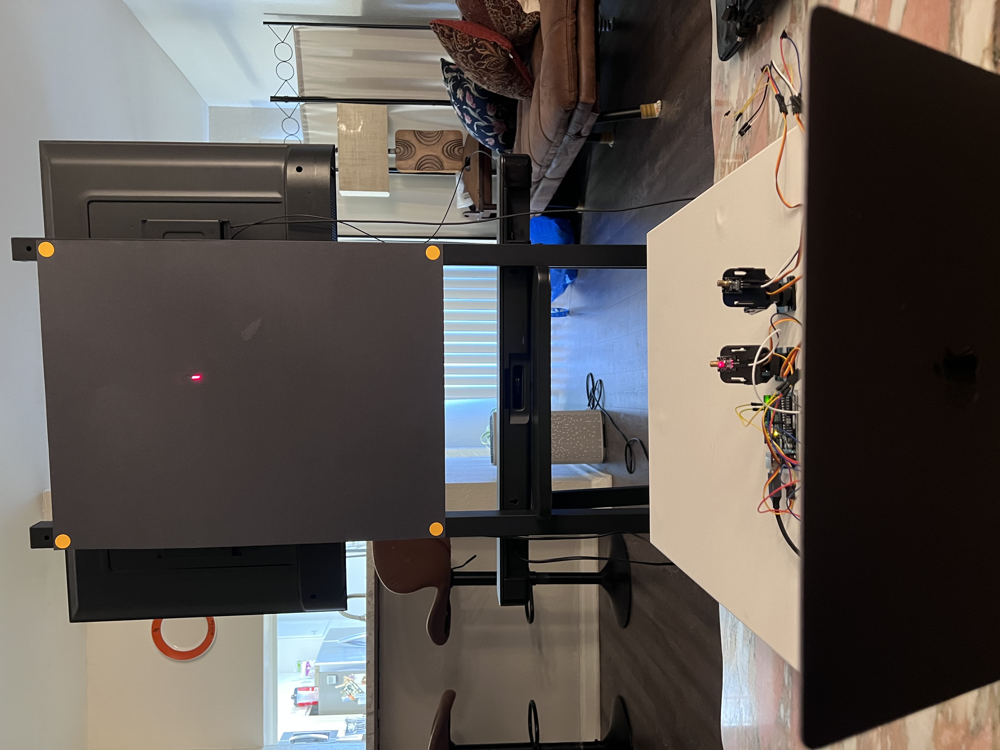
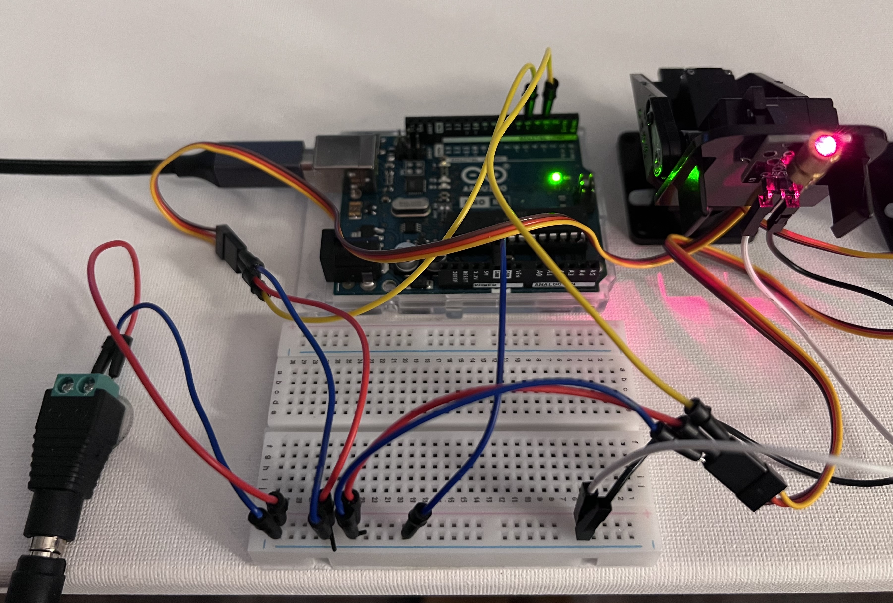

https://github.com/user-attachments/assets/85b82594-3472-4b5a-9d3a-5717e21512dc

# Laser Gimbal Pursuit Benchmark

**Which control law best aims a laser at a moving target — a hand-tuned
classical controller, tabular Q-learning, a DQN, a CNN, or a staged hybrid?**
I built the rig, measured all of them on the same hardware, and published the
data.




*Gimbal and Arduino in the foreground, target board roughly two metres away.
The four orange dots define the workspace — everything outside that quad is
masked and invisible to the code.*



*Servos run from a separate 5–6 V supply with a common ground to the Uno.*

---

## TL;DR

- A pan/tilt gimbal with a red laser chases a virtual target across a black
  board. A webcam closes the loop on **where the laser dot actually is**, not
  where it was commanded.
- The script measures the servo's real pixel speed on the hardware, builds a
  matched simulator from the detected board geometry, trains policies in it,
  and deploys them back to the same rig.
- **The winner is a three-stage hybrid**: a learned policy for the approach,
  bang-bang with continuous steering for the mid-course, and a velocity
  feedforward controller to stay on target.
- My first DQN scored **0.1%**. It looked hopeless next to a PID controller.
  It turned out I had three separate bugs. Fixed, it hit **100%**.
- Every number below comes from committed CSVs. The ablations use permutation
  tests, and every session includes a drift control.

---

## Final results

30 sweeps per arm for the controllers under test, 10 for the two reference arms.
Full data in [`results/`](results/).

| Arm | Hit rate | Closest approach | Time on target | Post-hit error |
|---|---|---|---|---|
| **Staged hybrid (kh=0.40)** | **100%** | **4.6 px** | **8.1 frames** | **15.5 px** |
| Staged hybrid (kh=0.60) | 100% | 5.1 px | 7.5 frames | 16.8 px |
| Staged, learned stage removed | 100% | 7.9 px | 3.9 frames | 30.8 px |
| Tabular Q-learning alone | 80% | 17.1 px | 1.2 frames | 40.5 px |
| Classical P controller | 0% | 43.2 px | 0 frames | — |

**Metrics.** *Closest approach* is the minimum laser-to-target distance over a
whole sweep. *Time on target* counts frames within 15 px. *Post-hit error* is
the mean distance after the first hit — a continuous version of "time on
target" that turned out about 3x less noisy.

**What the table says.** Removing the learned stage costs 15 px of tracking
error (p ≤ 0.0001). The hold gain `kh` is flat between 0.40 and 0.60 (p ≈ 0.47)
— not a knob worth tuning. The classical P controller never catches at all, and
that failure is structural, not tuning: a proportional controller tracking a
ramp input has finite steady-state error by construction. Adding an integrator
fixed it exactly as theory predicts, 0/3 → 3/3 catches.

---

## The controller that won

Three stages, selected each frame by distance to the target:

| Distance | Stage | Law |
|---|---|---|
| > 160 px | Q-TABLE | learned policy, 8 discrete directions, full speed |
| 160 → 22 px | BANG-BANG | full speed, *continuous* heading, aims 2 frames ahead |
| < 22 px | HOLD | matches the target's velocity, then trims the error |

The HOLD stage is the interesting one. Every discrete policy I tested caught
the target and then **bounced straight off it** — 8 actions at a fixed full
speed have no way to take a small step, so the dot flickers on and off. HOLD
adds feedforward:

```python
vx = V_SPEED * t_dir + kh * (goal_x - hx)   # match the target's velocity, then trim
vy =                   kh * (goal_y - hy)
```

A purely error-driven controller has to let error *build* before it reacts.
Copying the target's velocity outright removes the steady-state error, and
feedback only handles the residual. This raised time-on-target 4–9x and is the
single largest improvement in the project.

Staged guidance like this is a standard robotics pattern — midcourse/terminal
in missile guidance, coarse-to-fine in manipulation. What's less common is
measuring what each stage contributes instead of asserting it.

---

## What actually made the difference

The interesting part of this project wasn't the architecture. It was that the
neural methods failed for three identifiable reasons, and tabular Q-learning
was immune to all three — which is exactly why the simple method "won" at first.

### 1. Reward scale was wrong for the optimizer
Rewards were ±1000. Adam at `lr=1e-3` moves each parameter by roughly `lr` per
step regardless of gradient magnitude, so the network cannot grow its outputs
to that magnitude within the training budget — and Huber loss sits in its flat
region the whole time. A table doesn't care: one catch writes 100 into a cell
immediately. Rescaling to ±1 took the CNN from **5% → 100%** greedy.

### 2. Replay ratio caused value overestimation
The DQN backpropped every step at batch 64, replaying each transition ~64
times against a target network refreshed only every 1000 steps. The symptom was
diagnostic: its *exploring* catch rate (67.7%) beat its own *greedy* rate
(47%) — the policy was degrading late in training. Batch 32 every 2 steps took
it **47% → 100%**.

### 3. The simulator let the agent cheat
`sim_hy` could drift anywhere, so overshooting the board was free. On the real
rig, leaving the board means the laser leaves the detection polygon, `h_found`
goes False, and control freezes. The DQN scored **100% in sim and 1/3 on
hardware** until the boundary was added.

An exploration-schedule fix contributed too (**8.5% → 47%**). The full
progression, all on the same rig:

| Change | DQN greedy sim score |
|---|---|
| original (±1000 rewards) | 0.1% |
| + reward rescaling | 8.5% |
| + epsilon schedule | 47% |
| + replay ratio | 100% |

---

## Method notes

These mattered more than any control tweak:

- **Sample size beats arm count.** At n=10 the time-on-target metric had a
  standard deviation equal to its mean and nothing separated (all p > 0.27). At
  n=30, effects appeared at p ≤ 0.0001. Two earlier runs gave *opposite*
  answers on whether the learned stage mattered; only n=30 settled it.
- **Drift control.** Every session repeats its first condition last. The rig
  genuinely changes — one arm's closest approach moved 9.4 → 15.0 px across two
  runs with identical code. One drift check came back p = 0.012, which
  invalidated that session's comparisons.
- **Permutation tests, not eyeballing.** Several visually obvious effects were
  noise.
- **Optimising the loop changed the task.** The target moved a fixed number of
  pixels *per frame*, so speeding the loop from 17 → 29 fps made the target 75%
  faster and silently invalidated a whole run. Difficulty is now specified in
  px/second with the per-frame step derived from the measured frame rate.
- Sweep counts stay even, because direction alternates and an odd count biases
  the mean.

---

## Where the simulator was wrong

Calibrated against measured hardware results (lag = 2 frames, detection noise
= 1.0 px), it reproduced three controllers' closest approach to within 0.6 px.
It still got three things wrong:

| Prediction | Reality |
|---|---|
| PI reaches 2 px closest approach | 14 px |
| Scenario A (with a PI stage) beats Scenario B | reversed; A was half as good |
| `kh = 0.60` collapses from lag instability | identical to 0.40 |

Useful for generating hypotheses and bracketing parameters. **Not** trustworthy
for ranking architectures. Worth stating plainly, because a calibrated
simulator that matches three controllers is easy to over-trust.

---

## Known limitations

1. **Position-dependent gain (largest remaining defect).** The servo scale is
   one scalar, but a pan/tilt aimed at a plane has pixels-per-degree scaling as
   1/cos²θ. The board spans ~42° of pan, so the edges differ from the centre by
   ~15%, and the camera's oblique view compounds it. This corrupts the HOLD
   feedforward directly and is the likeliest reason post-hit error sits at
   ~15 px rather than a few.
2. The difficulty match is close but not exact — sweeps run ~1.5–1.9 s against
   a designed 2.35 s.
3. The lead term was tuned at 16 fps and hasn't been re-derived since the loop
   reached ~24 fps.

---

## Hardware

| Part | Detail |
|---|---|
| Compute | MacBook Pro 13" 2017, dual-core i5 (Intel — caps PyTorch at 2.2.2) |
| Controller | Arduino Uno, USB serial at 115200 baud |
| Actuators | 2 hobby servos on a pan/tilt gimbal — **pan D3, tilt D5** |
| Emitter | cheap red laser pointer, fixed to the gimbal |
| Sensor | built-in 1280×720 webcam |
| Target area | matte black board, four orange dots marking the corners |

The four orange dots define the workspace; everything outside that quad is
masked and invisible to the code. Servos are powered from a **separate 5–6 V
supply** with a common ground to the Uno. Running them off the Uno's onboard
regulator risks a brown-out, and a mid-run board reset looks exactly like a
tracking failure in the data.

Detection searches a 180×180 window around the last known dot position rather
than the full frame, with full-frame reacquisition on a miss. That plus the
baud increase took the loop from ~17 to ~24 fps; ROI hit rate runs ~96%.

## Software

Version pins matter more than usual here:

```
numpy==1.26.4          # NumPy >=2 breaks this PyTorch build
opencv-python==4.10.0.84  # 4.12 needs NumPy>=2 and SILENTLY returns no frames with 1.x
torch==2.2.2           # last Intel-Mac build
pyserial
```

The OpenCV/NumPy combination fails as a dead camera rather than an error, which
cost me a debugging session. If `cap.read()` returns `False` on a camera that
`isOpened()` reports as `True`, check these versions first.

## Running it

1. Upload [`firmware/gimbal_receiver.ino`](firmware/gimbal_receiver.ino) — set
   the pins if your wiring differs. The laser should swing to the ceiling on
   reset; that's the startup pose and confirms the right firmware is live.
2. Verify the hardware path with
   [`code/servo_test.py`](code/servo_test.py) — no camera, no vision, just
   serial. If the gimbal doesn't sweep here, nothing downstream can work.
   ([`pin_finder.ino`](firmware/pin_finder.ino) identifies which pin drives
   which servo if you don't know.)
3. Find your camera index — it is **not** stable if a phone offers Continuity
   Camera:
   ```bash
   python -c "
   import cv2
   for i in range(4):
       c = cv2.VideoCapture(i); ok = c.isOpened()
       r, f = (c.read() if ok else (False, None))
       print(i, ok, r, None if f is None else f.shape); c.release()"
   ```
   Set `CAMERA_INDEX` in the script to the one reporting a real frame shape.
4. `python code/benchmark_v2.py`. Press SPACE to begin, wait for the four
   corners to latch, press SPACE again to lock the board. It runs unattended
   from there and writes CSVs, trajectory images, and a video.

## Repo layout

```
code/       benchmark_v2.py, servo_test.py, and the offline analysis tools
firmware/   gimbal_receiver.ino, pin_finder.ino
results/    CSVs and trajectory images from the run reported above
media/      demo clip, photo of the rig
```

The offline tools (`calibrate_sim.py`, `search_phases.py`) have board geometry
**hardcoded** from screenshots of my own rig. Update those constants before
trusting their output.

---

## Next

Replacing the virtual target with a real RC car at varying speed. The
interesting change is that the target's velocity stops being known and has to
be estimated from vision — which is the one thing the HOLD stage currently gets
for free.
